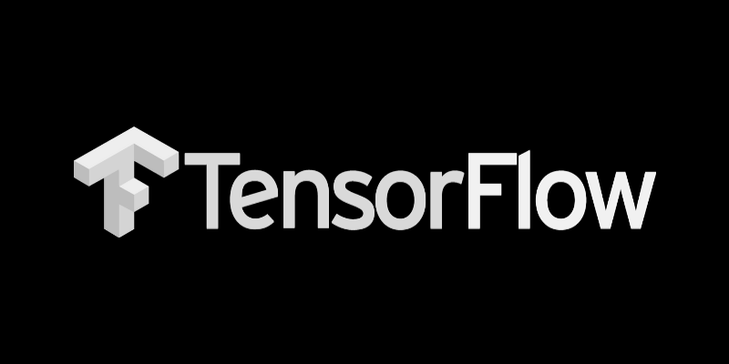
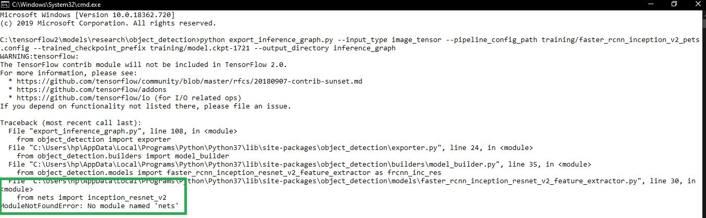
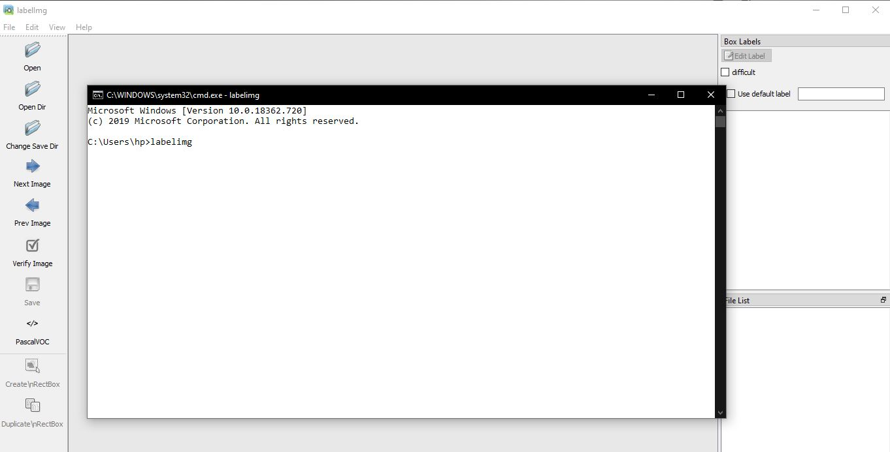

<p align="center">
  
</p>

# Tensorflow-Object-Detection-API

This is a Custom Object Detection using TensorFlow from Scratch. Here I have done a multi object classification for Kitchen Utilities. 

*You can also download the dataset from the link metioned below.*

**Link: http://homepages.inf.ed.ac.uk/rbf/UTENSILS/**

## Downloading Git repos

Along with this you need to download the Tensorflow Model git repo and faster rcnn model from TensorFlow's model zoo

Download the full TensorFlow object detection repository located at https://github.com/tensorflow/models by clicking the “Clone or Download” button and downloading the zip file.

## Supporting files and models

Faster-RCNN-Inception-V2 model. [Download the model here.](http://download.tensorflow.org/models/object_detection/faster_rcnn_inception_v2_coco_2018_01_28.tar.gz)

  The modules files that supports for this project is as shown below,
  
```
C:\> pip install protobuf
C:\> pip install pillow
C:\> pip install lxml
C:\> pip install matplotlib
C:\> pip install numpy
C:\> pip install scipy
C:\> pip install sklearn
C:\> pip install pandas
C:\> pip install opencv-python
```

**## Make sure that your always in admin mode when you work with protoc, if not you defenitely encounter error**

You may encounter an error which is **No module named 'deployment' or No module named 'nets'**
<p align="center">
  
</p>

to solve this do the following,
```
set PYTHONPATH=C:\tensorflow2\models
set PYTHONPATH=C:\tensorflow2\models\research
set PYTHONPATH=C:\tensorflow2\models\research\slim
```

**Once your done with this, you need to change the directory and then execute the following code**

```
C:\tensorflow2\models\research>
C:\tensorflow2\models\research> python setup.py build
C:\tensorflow2\models\research> python setup.py install
```
## LabelImg

LabelImg is a great tool for labeling images, and its GitHub page has very clear instructions on how to install and use it.

[LabelImg GitHub link](https://github.com/tzutalin/labelImg)

[LabelImg download link](https://www.dropbox.com/s/tq7zfrcwl44vxan/windows_v1.6.0.zip?dl=1)

or you also install with the help of python

```
C:\> pip install labelimg
C:\> labelimg
```
finally you will be having the following output

<p align="center">
  
</p>

## Generating TFRecord code

Make sure your inside the folder 
```
C:\tensorflow2\models\research\object_detection
```
```
python generate_tfrecord.py --csv_input=images\train_labels.csv --image_dir=images\train --output_path=train.record
python generate_tfrecord.py --csv_input=images\test_labels.csv --image_dir=images\test --output_path=test.record
```
